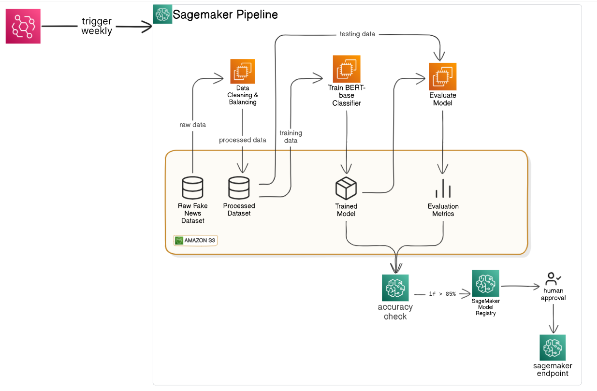

# 🚀 Building a SageMaker Pipeline to Train & Deploy a RoBERTa Fake News Detection Model

[]()
[]()
[]()

A fully automated AWS SageMaker Pipeline that ingests a raw “fake news” dataset, cleans & balances it, trains a RoBERTa classifier, evaluates its performance, and—if it meets your quality gates—packages & registers the model for deployment after human approval.

---


## 🏗️ Architecture



1. **Data Registration & understanding**  
2. **Pipeline Definition**  
3. **Processing (clean, balance, transform, split)**  
4. **Training (train on train+validation)**  
5. **Evaluation (test the trained model's performance on the test dataset)**  
6. **Conditional Model Registration**  
7. **Human approval and SageMaker endpoint deployment**

---

## ⚙️ Prerequisites

- Python 3.8 or above  
- AWS account with permissions for SageMaker, S3, IAM, CloudWatch  
- [AWS CLI v2](https://docs.aws.amazon.com/cli/latest/userguide/install-cliv2.html) configured  
- [`boto3`](https://github.com/boto/boto3), `sagemaker`,  `transformers`

```bash
pip install boto3 sagemaker protobuf transformers pandas
